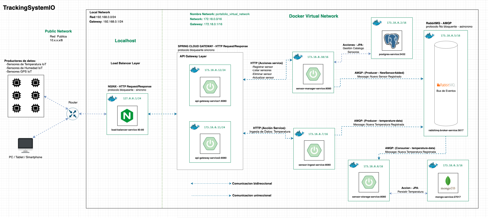

# Tracking System IOT

## Descripción

Este proyecto está diseñado para ingerir y procesar datos masivos de sensores IoT (Temperatura, GPS, Humedad). Cada dato ingerido es procesado y almacenado en un repositorio, facilitando una gestión y análisis eficiente de los datos. Este sistema cuenta con soporte para la gestion de sensores (alta, baja, actualizacion y consulta) a través de catalogos.

### Architectura
**Orientado a microservicios con enfoque a eventos**

El proyecto está diseñado con una arquitectura orientada a microservicios, con un enfoque de diseño basado en eventos. Implementando servicios redundantes para tolerar la carga en la red.



## Tecnologías

- **Nginx**: utilizado como balanceador de carga encargado de distribuir el trafico de la red entre los gateways
- **Ecosistema Spring y Spring Boot**:
  - **Spring Cloud Gateway**: Como puerta de enlace para distribuir la carga de la peticiones a los servicios de fondo
  - **Spring Web** Para crear una capa web util para escuchar y responder peticiones http.
  - **Spring JPA**: Para interactuar con las bases de datos a traves de la abstraccion y mapeo de las tablas y sus atributos en objetos
  - **Base de datos H2** (para pruebas): Base de datos en memoria para realizar testing y validar tanto entradas como salidas de procesos.
- **PostgreSQL**: Para gestionar los sensores dados de alta en la aplicacion.
- **MongoDB**: Para almacenar los datos crudos ingeridos de forma masiva por la aplicacion.
- **Docker y Docker-Compose**: utilizados para probar, construir y desplegar los microservicios en contenedores docker desplegados en la infraestructura de la red docker.
- **RabbitMQ**: Utilizado para recibir, procesar e enviar mensajes originados por los microservicios de las capas de balanceo de carga y API Gateway.

## Para comenzar

### Pre-requisitos

- [Docker Engine](https://www.docker.com/)
- [Docker Compose](https://docs.docker.com/compose/)
- [Java 17+ Correto](https://www.oracle.com/java/technologies/javase-downloads.html) (para ejecutar aplicaciones Spring Boot)
- [Servidor PostgreSQL](https://www.postgresql.org/) (para gestionar catálogos de sensores)
- [Servidor MongoDB](https://www.mongodb.com/) (para almacenar datos de los sensores)
- [Servidor RabbitMQ](https://www.rabbitmq.com/) (para el procesamiento de mensajes)

### Instalación
1. **Clona el repositorio:**
```bash
git clone git@192.168.1.174:insighttechio/tracking-system-io.git
```

2. **Navega al proyecto:**
```bash
cd tracking-system-io/
```
3.- **Construye e inicializa los servicios usando Docker-Compose**
```bash
# Levanta los servicios en primer plano
docker-compose up
# Levanta los servicios en segundo plano
docker-compose up -d
```
